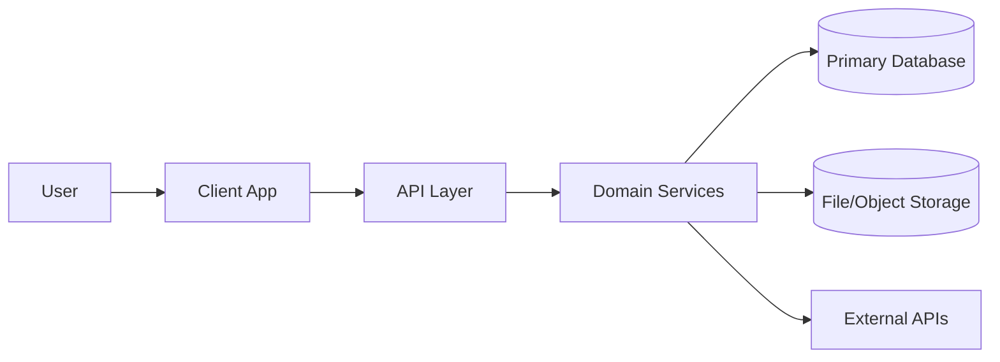
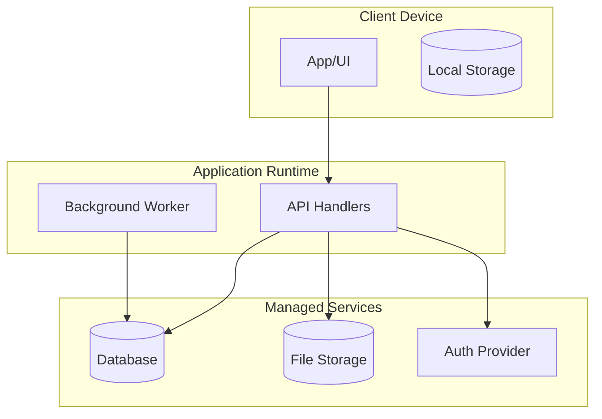
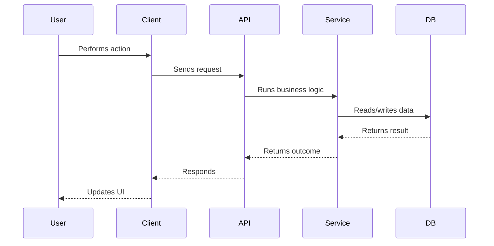
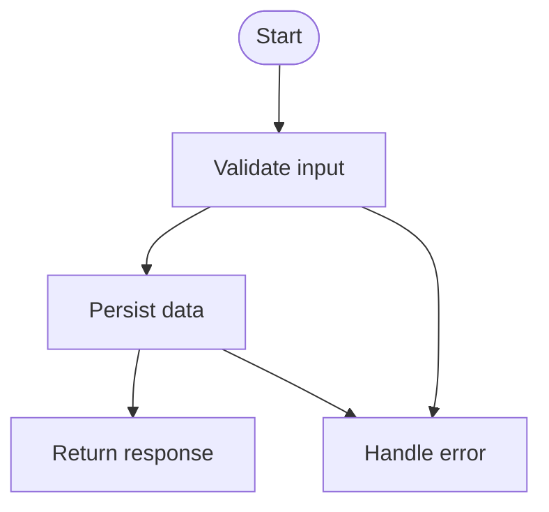
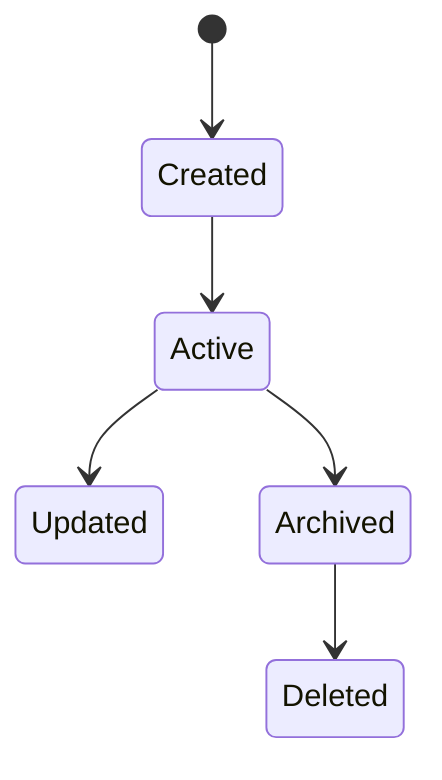

# System Architecture Mapper

## Purpose

Use this skill to inspect the current repository and produce clear, evidence-backed architecture documentation.

Write for a technical product person first and an engineer second. Explain the system in plain English, define important technical terms, and use diagrams to reduce cognitive load. Still include file paths, functions, routes, data stores, process boundaries, and config evidence so engineers can validate the document.

Do not invent architecture. Base meaningful claims on code, configuration, schemas, infrastructure files, environment variables, tests, or documentation found in the repository. Separate confirmed facts from inferences, gaps, and unknowns.

## Required Workflow

### Phase 1: Repository Discovery

Inspect the repository before writing architecture docs. Prioritize these sources when present:

- Application entry points: frontend roots, mobile entry points, server entry points, API routes, serverless or edge functions, workers, cron jobs, CLI commands, and background processors.
- Component boundaries: screens, pages, components, API/client layers, backend services, domain modules, shared libraries, infrastructure modules, auth modules, integration adapters, and logging/observability modules.
- Runtime processes: request/response flows, async jobs, queues, scheduled jobs, webhooks, event listeners, retries, AI/LLM calls, upload/download processing, notifications, search, export, and batch processing.
- Persistence: migrations, schemas, ORM models, generated types, object/file storage, local device storage, cache layers, durable queues, search indexes, vector stores, analytics stores, cookies, session storage, and environment/config persistence.
- External integrations: auth, payments, analytics, email/SMS/push, cloud services, AI/LLM providers, webhook sources, data import/export, scraping/fetching services, and observability.
- Infrastructure and deployment: Dockerfiles, compose files, CI/CD workflows, hosting config, runtime config, environment examples, infrastructure-as-code, package scripts, and build scripts.

Recommended files and directories to inspect when present:

- `README*`
- `AGENTS.md`
- `package.json`
- lockfiles such as `package-lock.json`, `pnpm-lock.yaml`, or `yarn.lock`
- config files such as `tsconfig.json`, `vite.config.*`, `next.config.*`, or `nuxt.config.*`
- `app/`, `pages/`, `src/`, `server/`, `api/`, `routes/`
- `supabase/`, `firebase/`, `prisma/`, `drizzle/`, `db/`, `migrations/`
- `schema.*`
- `Dockerfile`, `docker-compose.yml`
- `.github/workflows/`
- `.env.example`, `.env.local.example`, `config/`
- `terraform/`, `infra/`, `pulumi/`, `cloudformation/`
- `workers/`, `jobs/`, `queues/`, `cron/`
- `tests/`, `__tests__/`, `e2e/`

Use repository search tools to find keywords such as:

- `route`, `handler`, `controller`, `service`, `repository`, `model`, `schema`, `migration`
- `auth`, `session`, `token`, `webhook`, `queue`, `job`, `cron`, `worker`
- `storage`, `upload`, `download`, `cache`, `redis`, `s3`, `supabase`, `firebase`, `prisma`, `drizzle`
- `openai`, `anthropic`, `stripe`, `sendgrid`, `resend`, `twilio`, `segment`, `posthog`, `sentry`

Clearly state coverage limitations in the final documentation when the repo is too large to inspect exhaustively.

### Phase 2: Architecture Inventory

Before creating the final document, build an internal inventory. Do not publish this inventory as a separate artifact unless asked.

Identify:

- System purpose as inferred from the repo.
- Main user-facing surfaces.
- Main backend/API surfaces.
- Main data stores and persistent entities.
- Main runtime processes.
- Main external integrations.
- Main environment/config dependencies.
- Known deployment boundaries.
- Unknown or ambiguous areas.

If the repo is large, prioritize entry points, routes/API handlers, database/schema files, service modules, integration modules, infrastructure/config files, and tests that reveal intended behavior.

### Phase 3: Documentation Output

Create or update `docs/architecture/system-architecture.md` unless the user specifies another destination.

If architecture docs already exist, preserve useful existing content and update carefully. Do not delete existing docs unless explicitly asked.

The document must use this structure:

1. Executive Summary
2. Glossary
3. High-Level System Map
4. Component Inventory
5. Runtime and Deployment Boundaries
6. End-to-End System Flows
7. Data Model and Persistence
8. Process and Job Inventory
9. External Integrations
10. Configuration and Environment
11. Error Handling, Retries, and Fallbacks
12. Observability and Operational Signals
13. Architecture Risks and Ambiguities
14. Evidence Index

## Required Document Sections

### 1. Executive Summary

Explain in plain English:

- what the system appears to do
- who or what uses it
- the major parts of the system
- the most important data flows
- where data is stored
- what external services it depends on

Keep this section understandable to a technical product person.

### 2. Glossary

Define important system-specific terms, acronyms, entities, services, and data stores.

Use this table:

| Term | Plain-English Meaning | Technical Evidence |
| --- | --- | --- |

### 3. High-Level System Map

Include a Mermaid diagram showing the major system areas. Include user/client, frontend/mobile app, backend/API layer, service/domain layer, database, storage, cache, queues/jobs/workers, auth provider, third-party APIs, analytics/observability, and deployment/runtime boundaries when present.

Use a focused diagram similar to:



After the diagram, include a plain-English explanation, key components, and evidence.

### 4. Component Inventory

Create a table of all major components:

| Component | Responsibility | Runtime / Location | Inputs | Outputs | Persistence | Evidence |
| --- | --- | --- | --- | --- | --- | --- |

Include frontend, backend, workers, jobs, external services, data stores, and infrastructure components.

### 5. Runtime and Deployment Boundaries

Explain where code appears to run. Mark boundaries as confirmed, inferred, or unknown.

Include a Mermaid diagram similar to:



### 6. End-to-End System Flows

Document the most important flows actually present or strongly implied by code. Include relevant flows such as app startup, authentication/session lifecycle, primary user action, data creation/write, data read/retrieval, file/image/audio upload, AI/LLM processing, external content ingestion, search/recommendation, payment/subscription, notification, webhook, background job, scheduled/cron, export/share, and error/retry/fallback.

For each flow, use this template:

````markdown
### Flow: <Name>

**Purpose:**
Explain why this flow exists in product terms.

**Trigger:**
What starts the flow.

**Plain-English walkthrough:**
1. Step a technical product person can follow.
2. Next step.

**Sequence diagram:**



**Process diagram:**



**Persistence touched:**

| Store | Entity / Data | Read | Write | Update | Delete | Evidence |
| --- | --- | ---: | ---: | ---: | ---: | --- |

**External services touched:**

| Service | Purpose | Data Sent | Data Received | Evidence |
| --- | --- | --- | --- | --- |

**Failure behavior:**
Summarize validation failures, auth failures, network failures, external API failures, persistence failures, retry/fallback behavior, and user-visible result.

**Evidence:**
List file paths, functions/classes/components, route names, schema/migration references, and config references.

**Unknowns / ambiguities:**
List anything not clear from the repo or inferred but not confirmed.
````

### 7. Data Model and Persistence

Document where state lives. Include primary database, local storage, object/file storage, cache, queues, vector store, analytics store, third-party systems of record, cookies, and session storage when present.

Use this persistence table:

| Persistence Layer | Technology | Entities / Data | Created By | Read By | Updated By | Retention / Lifecycle | Evidence |
| --- | --- | --- | --- | --- | --- | --- | --- |

Then document key entities:

| Entity | Plain-English Meaning | Fields / Attributes | Relationships | Source of Truth | Evidence |
| --- | --- | --- | --- | --- | --- |

If schema files exist, derive entities from schemas, migrations, or models. If not, infer carefully from code and mark as inferred.

Include a lifecycle diagram for important entities:



Customize states based on actual code.

### 8. Process and Job Inventory

Document non-UI and non-request/response processes, including workers, cron jobs, queues, scheduled tasks, webhook handlers, event listeners, batch jobs, sync jobs, AI processing jobs, and file processing jobs.

Use this table:

| Process | Trigger | Runs Where | Input | Output | Persistence Touched | Retry / Failure Behavior | Evidence |
| --- | --- | --- | --- | --- | --- | --- | --- |

If no background processes are found, explicitly say so and include search evidence.

### 9. External Integrations

Document every external dependency detected in code/config:

| Integration | Purpose | Called From | Data Sent | Data Received | Auth / Config | Failure Handling | Evidence |
| --- | --- | --- | --- | --- | --- | --- | --- |

Include API providers, auth providers, database-as-a-service, analytics, payments, notifications, storage, AI providers, scraping/fetching services, and observability tools.

Do not claim an integration exists only because a dependency is installed. Confirm with imports, config, runtime references, or docs. Mark dependency-only evidence as possible, not confirmed.

### 10. Configuration and Environment

Document important configuration without exposing secret values:

| Config / Env Var | Purpose | Used By | Required? | Default / Example | Evidence |
| --- | --- | --- | --- | --- | --- |

Only document variable names and purposes.

### 11. Error Handling, Retries, and Fallbacks

Summarize how the system handles validation errors, auth/session errors, API errors, database errors, storage/upload errors, external provider errors, AI/LLM errors, network errors, retries, fallback paths, user-visible error states, and logging/monitoring.

Use this table:

| Failure Type | Where It Occurs | Current Behavior | User Impact | Observability | Evidence |
| --- | --- | --- | --- | --- | --- |

### 12. Observability and Operational Signals

Document detected logging, metrics, tracing, analytics, monitoring, alerts, crash reporting, and audit logs:

| Signal Type | Tool / Mechanism | What It Captures | Where Implemented | Evidence |
| --- | --- | --- | --- | --- |

If not present, say what was not found.

### 13. Architecture Risks and Ambiguities

Only include risks grounded in code or missing evidence:

| Risk / Ambiguity | Why It Matters | Evidence | Suggested Follow-Up |
| --- | --- | --- | --- |

Examples include unclear source of truth, missing retry behavior, duplicated persistence paths, untyped API boundaries, hidden third-party dependencies, missing auth guards, unclear background job ownership, incomplete error handling, and missing observability around critical flows.

### 14. Evidence Index

List the most important files inspected:

| Area | Files / Directories | Why They Matter |
| --- | --- | --- |

## Diagram Rules

Use Mermaid diagrams inside Markdown. Prefer multiple focused diagrams over one giant diagram.

For a technical product audience:

- Every diagram must have a short plain-English explanation before or after it.
- Every diagram must identify the main actors/components.
- Every diagram must include evidence references nearby.
- Avoid diagrams with more than about 12 nodes unless there is no simpler option.
- If a diagram becomes too large, split it into system overview, frontend flow, backend flow, persistence flow, async/background flow, or external integration flow.

Use these Mermaid diagram types as appropriate:

- `flowchart` for system maps, component maps, data movement, and process logic.
- `sequenceDiagram` for request/response or multi-service interactions.
- `stateDiagram-v2` for entity lifecycle and job lifecycle.
- `erDiagram` for relational data models when schema relationships are clear.
- C4-style `flowchart` diagrams for context/container/component views when Mermaid C4 syntax is unnecessary.

## Evidence Rules

For each important claim, include source evidence. Evidence can include file paths, function names, class names, component names, route names, schema/table/model names, migrations, environment variables, package dependencies, config files, tests, READMEs, or docs sections.

Use concise evidence references like:

- `src/app/page.tsx`
- `src/api/users/route.ts`
- `src/services/auth.ts:getCurrentUser`
- `supabase/migrations/20240501_create_projects.sql`
- `prisma/schema.prisma: Project`
- `package.json:scripts`
- `.github/workflows/deploy.yml`

Include exact line numbers when readily available. Otherwise include paths and symbols.

Distinguish evidence levels:

- **Confirmed:** directly visible in code/config/schema.
- **Inferred:** likely based on naming or usage, but not explicitly documented.
- **Unknown:** not enough repository evidence.

Do not use unsupported language such as "obviously" or "clearly." Use plain confidence labels instead.

## Writing Style

Use clear, direct language.

Prefer: "When a user saves a link, the app sends the URL to the API, which fetches metadata and stores the result."

Avoid: "The application leverages a modularized service-oriented orchestration layer."

Use headings, tables, and diagrams to make the document skimmable. Assume the reader understands products, users, workflows, APIs, and databases, but may not know this repository's implementation details.

Briefly define important technical terms in product language, such as:

- Queue: a durable waiting line for work that should happen later or outside the user's immediate request.
- Object storage: a place for files like images, audio, PDFs, or generated exports.
- Webhook: an incoming notification from a third-party system that something changed.

## Safety and Scope

- Do not modify application behavior.
- Do not refactor code.
- Do not add dependencies.
- Do not create new runtime code unless explicitly requested.
- Do not expose secrets.
- Do not include actual secret values from environment files.
- Do not hide uncertainty; useful product-facing architecture docs make unknowns explicit.

## Completion Criteria

The task is complete when:

1. `docs/architecture/system-architecture.md` exists or has been updated.
2. The document includes executive summary, glossary, high-level system map, component inventory, runtime/deployment boundaries, end-to-end flows, data model and persistence, process/job inventory, external integrations, configuration/env vars, error/retry/fallback behavior, observability, architecture risks/ambiguities, and evidence index.
3. Diagrams are in Mermaid syntax.
4. Major claims include repository evidence.
5. Unknowns are clearly marked.
6. The document is understandable to a technical product person.
7. No application behavior was changed.

## Suggested Final Response

After creating or updating the architecture document, respond concisely with:

- the file created or updated
- the most important flows documented
- the main persistence layers found
- the most important unknowns or risks
- any areas that need human validation
