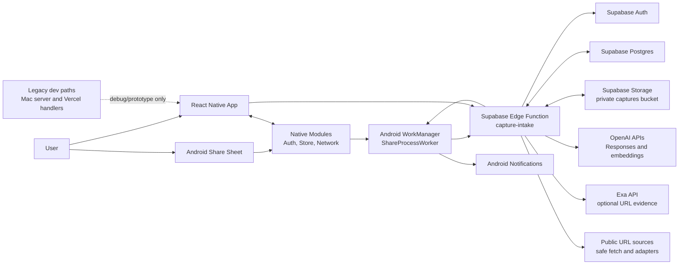
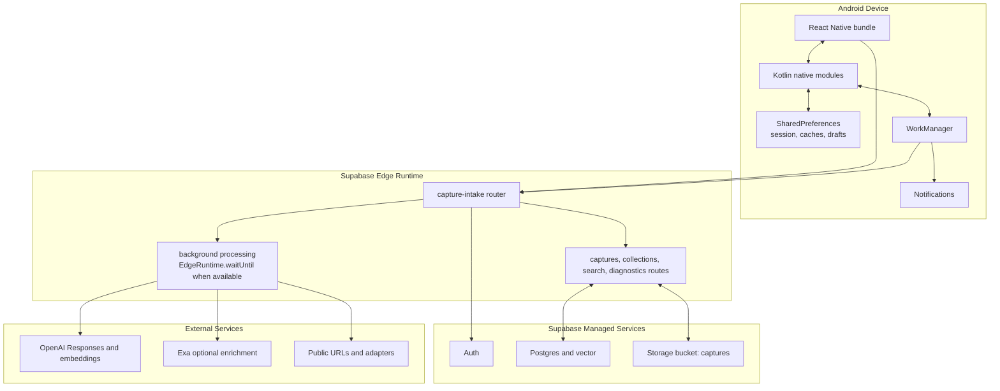
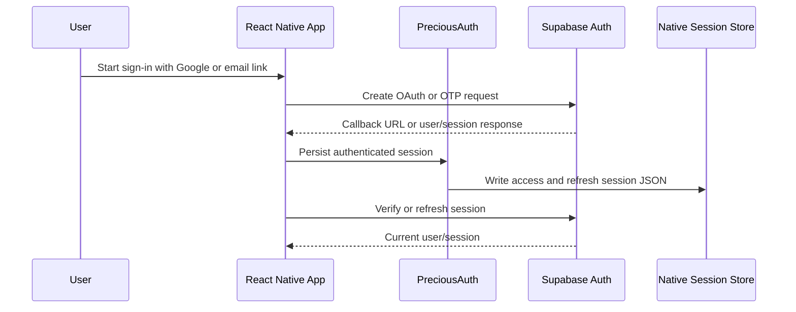
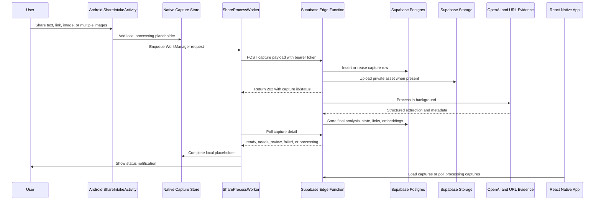
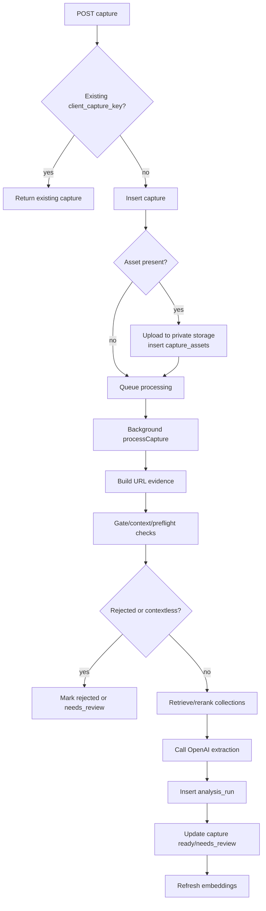
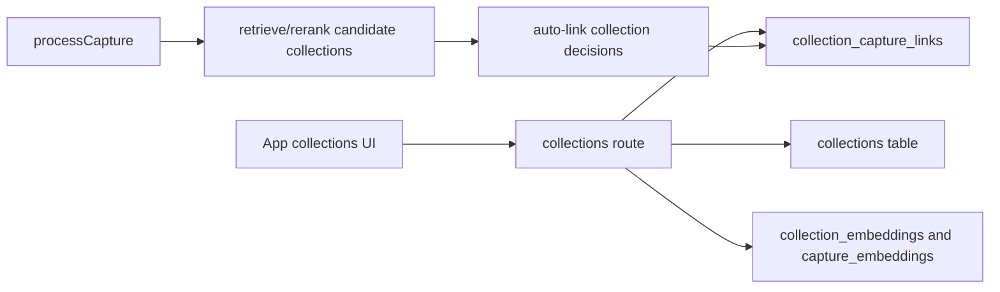
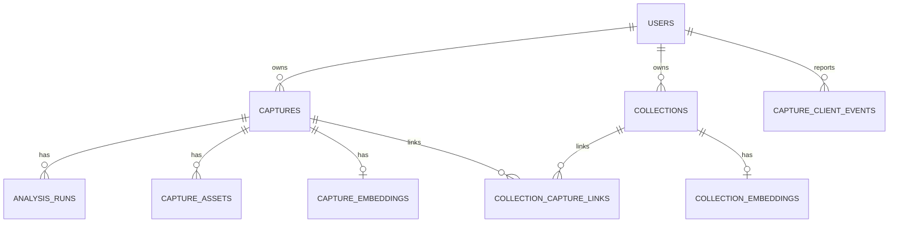
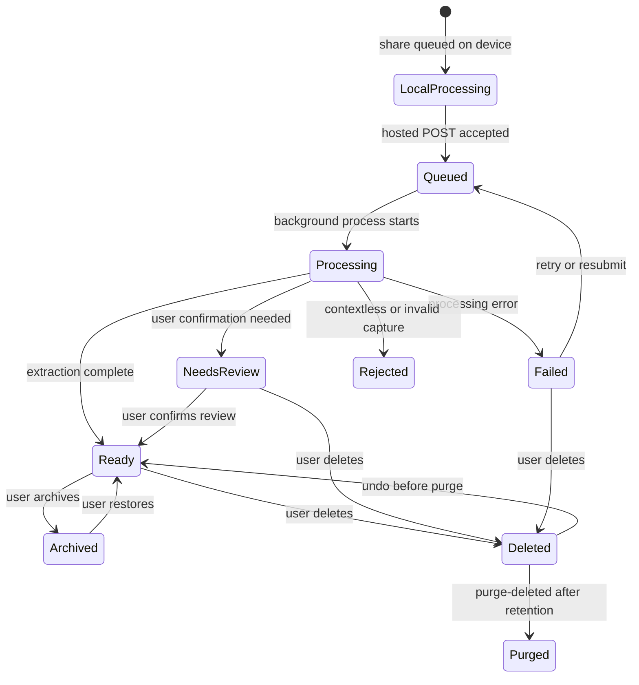

# System Architecture

This document maps the current Precious Captures system as implemented in the repository. It is written for technical product readers: it explains what the product does, where responsibilities live, how data moves, and which claims are supported by code or docs.

Evidence is cited with repository paths. Secret values are intentionally not reproduced; configuration is documented by variable name only.

## 1. Executive Summary

Precious Captures is an Android-first capture system. Users save links, text, and images from the Android share sheet or from the app. The current product path is Supabase-backed: native Android code queues share-sheet work, a background worker posts authenticated capture payloads to a Supabase Edge Function, and the Edge Function stores records, assets, URL evidence, collection links, analysis runs, and embeddings in Supabase while calling external AI/search services as needed. The React Native app then reads the same Supabase-backed API to show captures, search results, collections, review prompts, and undoable actions.

The app has three important runtime areas:

| Area | Responsibility | Evidence |
| --- | --- | --- |
| Android device | React Native UI, native auth/session bridge, native HTTP bridge, local caches, share-sheet intake, WorkManager background processing, user notifications. | `app/App.tsx`, `app/nativeBridge.ts`, `android/app/src/main/java/com/preciouscaptures/ShareIntakeActivity.kt`, `android/app/src/main/java/com/preciouscaptures/ShareProcessWorker.kt`, `android/app/src/main/java/com/preciouscaptures/CaptureAnalysisClient.kt` |
| Supabase Edge Function | Authenticated capture API, capture processing orchestration, OpenAI extraction, URL evidence, collection search/linking, mutations, client diagnostics, soft-delete purge endpoint. | `supabase/functions/capture-intake/index.ts`, `supabase/functions/capture-intake/lib/routes/router.ts`, `supabase/functions/capture-intake/lib/captures.ts`, `supabase/functions/capture-intake/lib/routes/*.ts` |
| Supabase managed services | Auth, Postgres persistence, Row Level Security, private capture asset storage, vector search extension. | `supabase/migrations/*.sql`, `supabase/functions/capture-intake/lib/supabase.ts`, `supabase/config.toml` |

The repository also keeps older development paths: a local Mac/server prototype and Vercel/Next API handlers. The README labels these as legacy/dev helpers, not the current product path (`README.md:90`, `README.md:105`).

## 2. Glossary

| Term | Meaning in This Repo | Evidence |
| --- | --- | --- |
| Capture | A saved unit of user content, usually a URL, text, or image, with extraction status and review metadata. | `app/types.ts`, `supabase/migrations/0001_barebones_capture.sql`, `supabase/functions/capture-intake/lib/capture-records.ts` |
| Capture asset | A file, usually an image, uploaded to private Supabase Storage and linked to a capture. | `supabase/migrations/0002_rich_content_metadata.sql`, `supabase/functions/capture-intake/lib/capture-records.ts` |
| Analysis run | A persisted record of an extraction attempt, including provider, model, mode, prompt/schema versions, and errors. | `supabase/migrations/0001_barebones_capture.sql`, `supabase/functions/capture-intake/lib/captures.ts` |
| URL evidence | Structured metadata collected from the shared URL, URL cache, safe fetch, platform adapters, and optional Exa lookup. | `supabase/functions/capture-intake/lib/url-evidence/pipeline.ts`, `supabase/functions/capture-intake/lib/url-evidence/cache.ts`, `supabase/functions/capture-intake/lib/url-evidence/exa.ts` |
| Collection | A user-owned grouping target for captures, backed by relational links and vector embeddings. | `supabase/migrations/0008_collections_first_class.sql`, `supabase/functions/capture-intake/lib/routes/collections.ts` |
| Review target | A field or decision the app asks the user to confirm, such as collection choice, reminder, or extraction details. | `app/types.ts`, `supabase/functions/capture-intake/lib/routes/captures.ts` |
| Native capture store | Android SharedPreferences-backed local storage for processing placeholders, caches, review drafts, and local fallback state. | `android/app/src/main/java/com/preciouscaptures/PreciousCaptureStore.kt`, `app/types.ts` |
| Hosted capture API | The Supabase Edge Function endpoint used by the app and Android worker for current production-like capture operations. | `README.md:90`, `app/remoteData.ts`, `android/app/src/main/java/com/preciouscaptures/PreciousAuth.kt` |
| Legacy server/API | Older local Mac and Vercel/Next handlers retained for debugging/prototype paths. | `README.md:105`, `server/index.mjs`, `api/*.js`, `pages/api/*.js` |

## 3. High-Level System Map

Key product flow:

1. A user shares content to Precious Captures or creates/edits it in the app.
2. The app or Android background worker uses a persisted Supabase session to call the hosted capture API.
3. The Edge Function authenticates the user, writes the capture and any asset, then processes analysis in the background.
4. Analysis builds URL evidence, optionally enriches weak evidence, calls OpenAI, links collections, records analysis runs, and stores final capture state.
5. The app reloads or polls capture list/detail/search resources and renders review actions.

Evidence: `README.md:3`, `README.md:90`, `ShareIntakeActivity.kt`, `CaptureAnalysisClient.kt`, `supabase/functions/capture-intake/lib/routes/router.ts`, `supabase/functions/capture-intake/lib/captures.ts`.

## 4. Component Inventory

| Component | Runtime | Primary Responsibilities | Main Inputs | Main Outputs | Evidence |
| --- | --- | --- | --- | --- | --- |
| React Native app shell | Android app | Coordinates auth, capture feeds, collections, review screens, search, sheets, caches, and route state. | User gestures, deep links, hosted API responses, native store caches. | UI state, hosted API calls, local draft/cache writes. | `app/App.tsx` |
| Auth session hook | Android app | Loads native config/session, validates Supabase user, refreshes tokens, starts OAuth/OTP sign-in, persists native session. | Supabase URL/anon key, native persisted session, callback URLs. | `AuthSession`, bearer token, native session updates. | `app/state/useAuthSession.ts`, `android/app/src/main/java/com/preciouscaptures/PreciousAuth.kt` |
| Native bridge | Android app | Exposes native Auth, CaptureStore, Network, and Clipboard modules to React Native. | JS method calls. | Native storage, HTTP, clipboard, auth bridge results. | `app/nativeBridge.ts`, `app/types.ts`, `android/app/src/main/java/com/preciouscaptures/PreciousCaptureStoreModule.kt` |
| Native capture store | Android app | Stores local processing captures, capture page cache, collection page cache, review drafts, and local fallback mutations. | Capture IDs, user IDs, pages, drafts, status updates. | SharedPreferences-backed JSON records. | `android/app/src/main/java/com/preciouscaptures/PreciousCaptureStore.kt` |
| Native network module | Android app | Performs HTTP requests from native side and retries transient network failures. | Method, URL, headers, body. | Status code, response body, request errors. | `android/app/src/main/java/com/preciouscaptures/PreciousNetworkModule.kt`, `app/nativeBridge.ts` |
| ShareIntakeActivity | Android app | Handles Android SEND/SEND_MULTIPLE intents, copies shared files, enqueues capture work, shows queue notification. | Shared text, image streams, MIME type, native auth state. | Local processing capture, WorkManager request, toast/notification. | `android/app/src/main/java/com/preciouscaptures/ShareIntakeActivity.kt`, `android/app/src/main/AndroidManifest.xml` |
| ShareProcessWorker | Android WorkManager | Uploads/analyses shared capture in the background and updates local/notification state. | WorkManager input data, native auth/session, copied asset path. | Remote capture result, local capture completion, retry/failure notification. | `android/app/src/main/java/com/preciouscaptures/ShareProcessWorker.kt`, `android/app/src/main/java/com/preciouscaptures/CaptureWork.kt` |
| CaptureAnalysisClient | Android worker helper | Posts capture payloads to hosted API, polls remote detail, reports client network diagnostics. | Capture source data, bearer token, API URL. | Remote capture model, retry signals, client events. | `android/app/src/main/java/com/preciouscaptures/CaptureAnalysisClient.kt` |
| Edge router | Supabase Edge | Authenticates requests and dispatches resources/actions. | HTTP request, bearer token, `resource` query parameter. | JSON responses, background tasks, HTTP errors. | `supabase/functions/capture-intake/index.ts`, `supabase/functions/capture-intake/lib/routes/router.ts` |
| Capture routes | Supabase Edge | Lists/detail captures, accepts new captures/assets, mutates capture review/delete/archive state. | Authenticated user, capture payloads, action patches. | Capture rows, linked collections, signed asset URLs, 202 intake responses. | `supabase/functions/capture-intake/lib/routes/captures.ts` |
| Capture processing pipeline | Supabase Edge | Loads capture/assets, creates URL evidence, gates/context checks, runs extraction, links collections, stores analysis. | Capture row, assets, URL evidence, OpenAI config, collections. | Updated capture status, analysis run, embeddings, linked collections. | `supabase/functions/capture-intake/lib/captures.ts`, `supabase/functions/capture-intake/lib/analysis/*.ts` |
| URL evidence pipeline | Supabase Edge | Normalizes URLs, reads/writes URL cache, safe-fetches public URLs, invokes platform adapters and optional Exa enrichment. | Source URL, client-resolved URL, cache rows, env keys. | `url_evidence_cache` row, normalized evidence payload, failure reason. | `supabase/functions/capture-intake/lib/url-evidence/*.ts` |
| Collection routes | Supabase Edge | Creates, updates, deletes, archives, restores, links, and lists collections. | User request, capture IDs, collection metadata. | Collection rows, link rows, embeddings refreshes. | `supabase/functions/capture-intake/lib/routes/collections.ts`, `supabase/migrations/0008_collections_first_class.sql` |
| Search route | Supabase Edge | Performs keyword and hybrid search across captures. | Query, mode, user, embeddings. | Capture result list with assets and linked collections. | `supabase/functions/capture-intake/lib/routes/search.ts`, `supabase/migrations/0014_capture_vector_search.sql`, `supabase/migrations/0015_fast_keyword_capture_search.sql` |
| Supabase persistence | Supabase managed | Stores users, captures, assets, analysis, collections, links, embeddings, URL cache, diagnostics. | Edge/admin writes and user-owned reads. | Relational rows, vector search results, signed asset URLs. | `supabase/migrations/*.sql`, `supabase/functions/capture-intake/lib/supabase.ts` |
| Client event route | Supabase Edge | Records bounded Android network diagnostics and trims old diagnostics opportunistically. | Authenticated event payload. | `capture_client_events` rows and retention cleanup. | `supabase/functions/capture-intake/lib/routes/client-events.ts`, `supabase/migrations/0010_capture_client_events.sql`, `supabase/migrations/0011_capture_client_event_guardrails.sql` |
| Hosted/release scripts | Local/CI | Build Android releases, deploy/verify Supabase hosted flow, run tests and evals. | npm scripts, GitHub Actions env. | APKs, Supabase deploys, verification output. | `package.json`, `.github/workflows/android-release.yml`, `docs/testing.md` |
| Legacy Mac/Vercel paths | Local/dev/serverless | Older capture/analyze APIs and local JSON storage, retained for debugging/prototype behavior. | HTTP requests. | Local JSON/API responses. | `README.md:105`, `server/index.mjs`, `api/*.js`, `pages/api/*.js` |

## 5. Runtime and Deployment Boundaries

| Boundary | Notes | Evidence |
| --- | --- | --- |
| Android app package | Expo/React Native app with Android package `com.preciouscaptures`; Android manifest registers share intents, deep link scheme, internet, and notification permission. | `app.json`, `android/app/src/main/AndroidManifest.xml` |
| Native build-time config | Android Gradle injects configured API/Supabase public settings into `BuildConfig`. Runtime code can derive the Edge Function URL from Supabase URL when an explicit API URL is not supplied. | `android/app/build.gradle`, `android/app/src/main/java/com/preciouscaptures/PreciousAuth.kt`, `README.md:35` |
| Edge Function | `capture-intake` is JWT-protected in Supabase config and additionally calls `currentUser` from the bearer token. | `supabase/config.toml`, `supabase/functions/capture-intake/lib/routes/router.ts`, `supabase/functions/capture-intake/lib/supabase.ts` |
| Database/storage | Migrations create user-scoped tables, RLS policies, private capture storage, vector search functions, soft delete fields, diagnostics, and caches. | `supabase/migrations/*.sql` |
| CI/release | GitHub Actions runs tests and builds hosted Android release artifacts. | `.github/workflows/android-release.yml`, `package.json`, `docs/testing.md` |
| Legacy/dev runtime | Local Mac server and Vercel/Next routes still exist, but README calls them earlier prototype/debug paths. | `README.md:105`, `server/index.mjs`, `api/*.js`, `pages/api/*.js` |

## 6. End-to-End System Flows

### 6.1 Authentication and Session Persistence

| Step | What Happens | Evidence |
| --- | --- | --- |
| Load native config/session | App loads configured Supabase/API settings and a previously saved native session. | `app/state/useAuthSession.ts`, `android/app/src/main/java/com/preciouscaptures/PreciousAuth.kt` |
| Sign in | App supports Google OAuth URL creation and email OTP/magic-link auth through Supabase Auth endpoints. | `app/state/useAuthSession.ts` |
| Persist session | Auth session is saved to native storage so Android share-sheet workers can run while the React Native app is not active. | `README.md:80`, `app/state/useAuthSession.ts`, `PreciousAuth.kt` |
| Refresh/retry | App refreshes expired sessions and retries after auth failures; native code can refresh with the refresh token. | `app/state/useAuthSession.ts`, `PreciousAuth.kt` |

Persistence touched: native SharedPreferences for session; Supabase Auth for users/tokens.

External services: Supabase Auth; Google OAuth through Supabase when Google sign-in is selected.

Failure behavior: missing hosted config leaves remote APIs unavailable; missing/expired sessions lead to sign-in or token refresh. Native share intake refuses hosted capture work when the user is not signed in and hosted API is configured.

### 6.2 Android Share or In-App Capture Intake

| Step | What Happens | Evidence |
| --- | --- | --- |
| Share intake | Manifest routes SEND/SEND_MULTIPLE image/text intents to `ShareIntakeActivity`; activity copies files to app cache and queues work. | `android/app/src/main/AndroidManifest.xml`, `ShareIntakeActivity.kt` |
| Work queue | WorkManager request has network constraints, capture metadata, linear backoff, and a capture tag. | `android/app/src/main/java/com/preciouscaptures/CaptureWork.kt` |
| Hosted POST | `CaptureAnalysisClient` posts the payload or multipart asset to the Edge API and tracks the remote capture ID. | `CaptureAnalysisClient.kt`, `supabase/functions/capture-intake/lib/routes/captures.ts` |
| Background processing | Edge route returns 202 after create/reuse and schedules `processCapture` in background. | `routes/captures.ts`, `common.ts` |
| AI extraction | Pipeline builds URL evidence, gates bad/contextless captures, retrieves collections, calls OpenAI, stores analysis, and refreshes embeddings. | `lib/captures.ts`, `lib/analysis/openai-client.ts`, `lib/analysis/preflight.ts`, `lib/analysis/capture-gate.ts`, `lib/collections/embeddings.ts` |
| App refresh | React Native app loads remote capture pages when hosted API and auth are available, with native cache/fallback behavior. | `app/App.tsx`, `app/remoteData.ts`, `app/state/useCaptureFeed.ts` |

Persistence touched: `captures`, `capture_assets`, private storage bucket `captures`, `analysis_runs`, `url_evidence_cache`, `collection_capture_links`, `capture_embeddings`, native processing placeholders and page caches.

External services: Supabase Auth/Postgres/Storage/Edge; OpenAI Responses and embeddings; optional Exa; public URL fetches/adapters.

Failure behavior: WorkManager retries while capture remains processing; native worker marks local failed on unrecoverable failure; Edge processing writes failed analysis runs and marks capture failed; URL cache writes and some embedding refreshes are best effort.

### 6.3 Capture Review, Edits, Archive, Delete, and Undo

| Trigger | Path | Persistence | Evidence |
| --- | --- | --- | --- |
| User opens a capture | App loads detail/list rows and maps Supabase data to app `Capture`. | `captures`, `capture_assets`, `collection_capture_links`, native page cache. | `app/App.tsx`, `app/remoteData.ts`, `routes/captures.ts` |
| User edits title, note, intent, review fields, or reminders | App sends authenticated PATCH actions to capture route. | `captures.analysis`, `captures.default_intent`, review fields, reminder fields. | `app/App.tsx`, `routes/captures.ts` |
| User accepts/clears/undoes collection decisions | Capture route updates links and analysis review metadata. | `collection_capture_links`, `captures.analysis`, embeddings refreshes. | `routes/captures.ts`, `lib/collections/embeddings.ts` |
| User archives/restores/deletes/undoes delete | Capture route sets timestamps such as archived/deleted/purge-after and supports undo. | `captures.archived_at`, `captures.deleted_at`, `captures.delete_purge_after`. | `routes/captures.ts`, `supabase/migrations/0017_delete_with_undo.sql` |
| User edits locally before remote save | Native store can keep review drafts. | Native SharedPreferences review drafts. | `app/App.tsx`, `PreciousCaptureStore.kt` |

Failure behavior: The app has local cache/draft storage for continuity. The route includes fallback paths for some schema-cache/column compatibility cases around delete/archive fields. Unknown: there is no evidence of a dedicated offline mutation queue beyond local processing placeholders, caches, and drafts.

### 6.4 Collection Lifecycle and Auto-Linking

| Flow | What Happens | Evidence |
| --- | --- | --- |
| Seed/list collections | Collection route can seed starter collections and return active collections with counts. | `routes/collections.ts`, `lib/config.ts` |
| Create/update collection | Route inserts/updates title/description and upserts embeddings. | `routes/collections.ts`, `lib/collections/embeddings.ts` |
| Link capture to collection | Direct route actions and capture review decisions write `collection_capture_links`. | `routes/collections.ts`, `routes/captures.ts` |
| Archive/restore collection | Archive snapshots active links and unlinks captures; restore can rebuild links from the snapshot. | `routes/collections.ts` |
| Auto-link during analysis | Capture processing retrieves/reranks collections, applies confidence rules, and persists links/review targets. | `lib/captures.ts`, `lib/config.ts`, `lib/collections/*.ts` |

Persistence touched: `collections`, `collection_capture_links`, `collection_embeddings`, `capture_embeddings`, capture analysis JSON.

External services: OpenAI embeddings; OpenAI may also be used for collection reranking where configured.

Failure behavior: Embedding refreshes are often background/best effort. If schema or vector search support is unavailable, collection/search behavior may degrade; migrations indicate vector extension is expected.

### 6.5 Search

| Mode | Data Path | Evidence |
| --- | --- | --- |
| Local fallback search | App can derive local search results from loaded/cached captures when remote search is unavailable. | `app/state/useCaptureSearch.ts`, `app/App.tsx` |
| Remote keyword search | App waits a short debounce, calls `resource=search` with keyword mode, and route calls a Postgres keyword RPC. | `app/state/useCaptureSearch.ts`, `routes/search.ts`, `supabase/migrations/0015_fast_keyword_capture_search.sql` |
| Remote hybrid search | App waits a longer debounce, calls hybrid mode, Edge embeds query with OpenAI, then calls vector search RPC. | `app/state/useCaptureSearch.ts`, `routes/search.ts`, `lib/collections/embeddings.ts`, `supabase/migrations/0014_capture_vector_search.sql` |
| Result hydration | Search route fetches captures, attaches linked collections and signed assets, and may schedule embedding refresh for misses. | `routes/search.ts`, `lib/capture-records.ts` |

Persistence touched: `captures`, `capture_assets`, `collection_capture_links`, `capture_embeddings`.

External services: OpenAI embeddings for hybrid search.

Failure behavior: Remote search is gated on hosted API configuration and signed-in user. Local search remains available when remote search is inactive.

### 6.6 Diagnostics, Cleanup, and Verification

| Flow | What Happens | Evidence |
| --- | --- | --- |
| Client network diagnostics | Android worker reports bounded network diagnostics to `resource=client-events`. Edge validates/sanitizes payloads and inserts rows. | `CaptureAnalysisClient.kt`, `routes/client-events.ts`, `supabase/migrations/0010_capture_client_events.sql`, `supabase/migrations/0011_capture_client_event_guardrails.sql` |
| Diagnostics retention | Posting a client event schedules deletion of old events based on retention config. | `routes/client-events.ts`, `lib/config.ts` |
| Soft-delete purge | `resource=purge-deleted` can purge expired deleted captures/assets/collections. | `routes/router.ts`, `routes/purge-deleted.ts`, `supabase/migrations/0017_delete_with_undo.sql` |
| Hosted verification | Test docs describe hosted verification that exercises intake, polling, LLM evidence, analysis runs, and optional image assets. | `docs/testing.md`, `package.json` |
| Android release | CI runs tests and builds hosted release APKs. | `.github/workflows/android-release.yml`, `package.json` |

Unknown: the repository does not show a scheduler or cron that invokes `purge-deleted`; it appears API-triggered/manual from the evidence available.

## 7. Data Model and Persistence

### Persistence Layers

| Layer | Stored Data | Owner/Access Pattern | Evidence |
| --- | --- | --- | --- |
| Native SharedPreferences | Session JSON, local processing captures, capture page cache, collection page cache, review drafts, local fallback statuses. | Android native modules and React Native bridge. | `PreciousAuth.kt`, `PreciousCaptureStore.kt`, `app/types.ts` |
| Supabase Auth | User identities and auth sessions. | Supabase Auth APIs; Edge validates bearer token. | `useAuthSession.ts`, `supabase.ts` |
| Supabase Postgres | Captures, analysis runs, assets metadata, collections, links, embeddings, URL cache, client diagnostics. | Edge admin client writes; RLS protects direct user-scoped tables. | `supabase/migrations/*.sql`, `supabase/functions/capture-intake/lib/supabase.ts` |
| Supabase Storage | Private capture files in `captures` bucket. | Edge uploads files and signs URLs for authenticated responses. | `supabase/migrations/0002_rich_content_metadata.sql`, `capture-records.ts` |
| Local dev JSON | Legacy local server capture data. | Local Mac/server prototype only. | `server/index.mjs`, `README.md:105` |

### Core Entities

| Entity/Table | Purpose | Key Relationships | Evidence |
| --- | --- | --- | --- |
| `captures` | User capture record and current analysis/review state. | Owned by user; has assets, analysis runs, collection links, capture embedding. | `0001_barebones_capture.sql`, later migrations |
| `analysis_runs` | History of AI extraction attempts and errors. | Belongs to capture and user. | `0001_barebones_capture.sql`, `lib/captures.ts` |
| `capture_assets` | Metadata for stored image/file assets. | Belongs to capture and user; points to storage path. | `0002_rich_content_metadata.sql`, `capture-records.ts` |
| `url_evidence_cache` | Cached normalized URL evidence and client-resolved URL metadata. | Used by URL evidence pipeline. | `0007_url_evidence_cache.sql`, `0012_client_url_resolution.sql`, `url-evidence/cache.ts` |
| `collections` | User-created grouping targets. | Linked to captures; has embedding. | `0008_collections_first_class.sql`, `routes/collections.ts` |
| `collection_capture_links` | Many-to-many capture-to-collection links. | Links captures and collections. | `0008_collections_first_class.sql`, `routes/captures.ts`, `routes/collections.ts` |
| `collection_embeddings` | Vector embedding per collection. | Belongs to collection and user. | `0008_collections_first_class.sql`, `collections/embeddings.ts` |
| `capture_embeddings` | Vector embedding per capture for hybrid search. | Belongs to capture and user. | `0014_capture_vector_search.sql`, `collections/embeddings.ts` |
| `capture_client_events` | Bounded client-side diagnostic events. | Belongs to user; tied to capture/client capture key when available. | `0010_capture_client_events.sql`, `0011_capture_client_event_guardrails.sql`, `routes/client-events.ts` |

### Capture State Model

Notes:

- The exact state enum is split across persisted `analysis_state`, app `Capture.status`, rejection/delete/archive timestamps, and local processing placeholders.
- Soft delete is timestamp-based and undoable until purge-after time.
- Review state is partly structured JSON inside `captures.analysis` plus explicit columns introduced by later migrations.

Evidence: `app/types.ts`, `app/remoteData.ts`, `routes/captures.ts`, `supabase/migrations/0016_capture_rejections.sql`, `supabase/migrations/0017_delete_with_undo.sql`.

## 8. Process and Job Inventory

| Process/Job | Trigger | Runs In | Retry/Retention | Evidence |
| --- | --- | --- | --- | --- |
| Android share work | Android share-sheet intake enqueues work. | WorkManager on device. | Network constraint and linear backoff; worker returns retry while remote status remains processing. | `ShareIntakeActivity.kt`, `CaptureWork.kt`, `ShareProcessWorker.kt` |
| Edge capture processing | New/reused capture POST schedules processing. | Supabase Edge background task. | `runInBackground` uses `EdgeRuntime.waitUntil` when available and logs failures; processing catches errors and marks capture failed. | `routes/captures.ts`, `common.ts`, `lib/captures.ts` |
| Capture embedding refresh | Capture analysis, search misses, collection changes. | Supabase Edge background/best effort. | Background scheduling with failure logging. | `lib/collections/embeddings.ts`, `routes/search.ts`, `routes/collections.ts` |
| Collection embedding upsert | Collection create/update and starter seeding. | Supabase Edge. | Writes embedding rows; collection behavior depends on vector support. | `routes/collections.ts`, `lib/collections/embeddings.ts` |
| Client event retention | Client event POST. | Supabase Edge background task. | Deletes events older than configured retention days opportunistically. | `routes/client-events.ts`, `lib/config.ts` |
| Soft-delete purge | Explicit `resource=purge-deleted` POST. | Supabase Edge route. | Purges expired soft-deleted data and assets. No scheduler found in repo. | `routes/router.ts`, `routes/purge-deleted.ts` |
| Hosted verify | Developer command. | Local machine against hosted Supabase. | Manual/CI-style validation, not a product runtime job. | `docs/testing.md`, `package.json` |
| Android release workflow | GitHub Actions. | CI. | Runs tests and build steps for release artifacts. | `.github/workflows/android-release.yml` |
| Legacy local server | Developer starts `server:dev`. | Local Mac/Node. | Prototype/debug only per README. | `README.md:105`, `server/index.mjs`, `package.json` |

## 9. External Integrations

| Integration | Used For | Runtime Path | Required/Optional | Evidence |
| --- | --- | --- | --- | --- |
| Supabase Auth | User auth, bearer token verification, OAuth/OTP. | App, native auth, Edge router. | Required for hosted flow. | `useAuthSession.ts`, `PreciousAuth.kt`, `supabase.ts`, `supabase/config.toml` |
| Supabase Postgres | Primary relational and vector persistence. | Edge Function. | Required for hosted flow. | `supabase/migrations/*.sql`, `lib/supabase.ts` |
| Supabase Storage | Private capture asset storage and signed image URLs. | Edge capture records and analysis. | Required for image/file capture assets. | `0002_rich_content_metadata.sql`, `capture-records.ts` |
| Supabase Edge Functions | Hosted capture API. | App and Android worker call `capture-intake`. | Required for current product path. | `README.md:90`, `index.ts`, `router.ts` |
| OpenAI Responses API | Capture extraction, capture gate, preflight checks, and structured outputs. | Edge analysis modules. | Required when AI analysis runs. | `analysis/openai-client.ts`, `analysis/preflight.ts`, `analysis/capture-gate.ts` |
| OpenAI embeddings API | Collection and capture vector embeddings, hybrid search. | Edge collection/search modules. | Required for hybrid/vector behavior. | `collections/embeddings.ts`, `routes/search.ts` |
| Exa | Optional URL evidence enrichment when local evidence is weak/blocked/failed/generic. | Edge URL evidence pipeline. | Optional via env var. | `url-evidence/exa.ts` |
| Public URL sources | Metadata extraction from shared links, platform adapters, oEmbed, safe fetch. | Edge URL evidence pipeline. | Conditional by capture URL. | `url-evidence/pipeline.ts`, `url-evidence/*.ts` |
| Android platform services | Share intents, notifications, WorkManager, clipboard, deep links. | Android native app. | Required for Android-first UX. | `AndroidManifest.xml`, `ShareIntakeActivity.kt`, `CaptureWork.kt`, `PreciousClipboardModule.kt` |
| Google OAuth | Google sign-in through Supabase Auth. | React Native auth flow. | Optional sign-in method. | `useAuthSession.ts` |
| GitHub Actions | Release/build automation. | CI. | Development/release support. | `.github/workflows/android-release.yml` |
| Gemini | Eval/silver-label tooling. | Local eval scripts. | Evaluation only, not current product runtime. | `.env.example`, `package.json`, `scripts/eval/*` |
| Vercel/Next handlers | Older hosted prototype routes. | Legacy/dev path. | Not current product path per README. | `README.md:105`, `api/*.js`, `pages/api/*.js` |

## 10. Configuration and Environment

Configuration should be discussed by variable name only. Real values belong in ignored environment files or deployment secret stores, not documentation.

| Variable/Setting | Purpose | Used By | Notes/Evidence |
| --- | --- | --- | --- |
| `EXPO_PUBLIC_SUPABASE_URL` | Public Supabase project URL for app/runtime config. | App, Android Gradle, scripts. | `.env.example`, `README.md`, `android/app/build.gradle` |
| `EXPO_PUBLIC_SUPABASE_ANON_KEY` | Supabase anon key for client Auth/API calls. | App, Android Gradle, scripts. | `.env.example`, `README.md`, `android/app/build.gradle` |
| `PRECIOUS_CAPTURE_FUNCTION_URL` | Explicit hosted Edge Function URL. | App and hosted verification scripts. | `.env.example`, `README.md`, `app/remoteData.ts` |
| `PRECIOUS_API_URL` | Android build-time API URL override. | Android Gradle/BuildConfig. | `android/app/build.gradle`, `PreciousAuth.kt` |
| `NEXT_PUBLIC_SUPABASE_URL` / `NEXT_PUBLIC_SUPABASE_ANON_KEY` | Public config aliases used by some web/legacy/dev paths. | Next/Vercel style code paths and config loaders. | `api/_lib/hosted.cjs`, `pages/api/*.js` |
| `SUPABASE_URL` | Server-side Supabase URL for Edge admin client. | Supabase Edge Function. | `lib/supabase.ts`, `common.ts` |
| `SUPABASE_SERVICE_ROLE_KEY` | Server-side service role key for Edge admin client. | Supabase Edge Function. | `lib/supabase.ts`; never expose value |
| `SUPABASE_ACCESS_TOKEN` | Supabase CLI deployment/auth token. | Deploy scripts. | `.env.example`, `README.md`, `package.json` |
| `OPENAI_API_KEY` | OpenAI API authentication. | Analysis, preflight, gate, embeddings, rerank. | `.env.example`, `analysis/openai-client.ts`, `collections/embeddings.ts` |
| `OPENAI_MODEL` | Default extraction model. | OpenAI analysis client. | `.env.example`, `analysis/openai-client.ts` |
| `OPENAI_CAPTURE_GATE_MODEL` | Optional capture gate model override. | Capture gate module. | `analysis/capture-gate.ts` |
| `OPENAI_PREFLIGHT_MODEL` | Optional preflight model override. | Preflight module. | `analysis/preflight.ts` |
| `OPENAI_COLLECTION_RERANK_MODEL` | Optional collection rerank model override. | Collection reranking module. | `lib/collections/rerank.ts` |
| `COLLECTION_AUTO_LINK_CONFIDENCE` | Auto-link threshold for collection decisions. | Collection matching/config. | `lib/config.ts` |
| `EXA_API_KEY` | Optional Exa URL evidence enrichment. | URL evidence Exa adapter. | `.env.example`, `url-evidence/exa.ts` |
| `GEMINI_API_KEY` / `GEMINI_LABEL_MODEL` | Evaluation/silver-label tooling. | Eval scripts. | `.env.example`, `package.json`, `scripts/eval/*` |
| `PRECIOUS_E2E_EMAIL` / `PRECIOUS_E2E_PASSWORD` | E2E/hosted verification account credentials. | Test and verification scripts. | `.env.example`, `docs/testing.md`, `package.json` |
| `PRECIOUS_EVAL_EMAIL` / `PRECIOUS_EVAL_PASSWORD` | Evaluation account credentials. | Eval scripts. | `package.json`, `scripts/eval/*` |
| `PRECIOUS_SHARE_SMOKE_*` | Android share smoke test configuration. | Test scripts. | `package.json`, `docs/testing.md` |
| `JAVA_HOME` | OpenJDK 17 override for Android builds. | Local build commands. | `README.md`, `AGENTS.md`, `docs/testing.md` |

## 11. Error Handling, Retries, and Fallbacks

| Area | Behavior | Evidence |
| --- | --- | --- |
| Auth failures | React Native API helper identifies 401/403; session hook refreshes and retries where possible. | `app/nativeBridge.ts`, `app/state/useAuthSession.ts` |
| Missing hosted config | App can fall back to native local capture store for loaded captures when hosted API is not configured. | `app/App.tsx`, `app/remoteData.ts` |
| Native network transient failures | Native network module retries transient request failures with short backoff. | `PreciousNetworkModule.kt` |
| Android share worker | WorkManager requires network, uses linear backoff, and returns retry while remote capture is still processing. | `CaptureWork.kt`, `ShareProcessWorker.kt`, `CaptureAnalysisClient.kt` |
| Remote capture processing failure | Edge processing inserts failed analysis runs and marks capture failed with error metadata. | `lib/captures.ts` |
| OpenAI image fetch/download problem | OpenAI analysis client can retry without image inputs for some image download failures. | `analysis/openai-client.ts` |
| URL evidence failures | Pipeline records evidence failure/weakness, can use cached evidence or optional Exa, and avoids private hostnames/addresses through safe fetch behavior. | `url-evidence/pipeline.ts`, `url-evidence/cache.ts`, `url-evidence/exa.ts`, `url-evidence/safe-fetch.ts` |
| Cache write failures | URL evidence cache writes catch/log failures so analysis can continue. | `url-evidence/cache.ts` |
| Schema drift around soft delete/archive | Capture route has fallback paths for missing schema cache/columns while setting archive/delete fields. | `routes/captures.ts` |
| Search remote unavailable | App gates remote search on hosted API/auth and can show local results. | `app/state/useCaptureSearch.ts` |
| Diagnostics validation | Client event route sanitizes and bounds diagnostic payloads before insert; migrations add guardrail constraints. | `routes/client-events.ts`, `0011_capture_client_event_guardrails.sql` |
| Background job failure visibility | Background helper logs failures; no dedicated alerting sink found. | `common.ts` |

## 12. Observability and Operational Signals

| Signal | What It Shows | Where to Look | Evidence |
| --- | --- | --- | --- |
| `analysis_runs` rows | AI processing attempts, model/provider/mode, prompt/schema versions, error details. | Supabase Postgres. | `0001_barebones_capture.sql`, `lib/captures.ts` |
| Capture status fields | User-visible processing, ready, needs review, failed, rejected, archived, deleted states. | `captures` table and app mapped state. | `app/types.ts`, `app/remoteData.ts`, `routes/captures.ts` |
| `capture_client_events` rows | Android upload/poll/network diagnostics. | Supabase Postgres. | `0010_capture_client_events.sql`, `0011_capture_client_event_guardrails.sql`, `routes/client-events.ts` |
| Native notifications | User-visible processing and completion/failure state for background share work. | Android notifications. | `ShareProcessWorker.kt`, `ShareIntakeActivity.kt` |
| Console logs/warnings | Edge background failures, cache failures, worker diagnostics. | Supabase logs, Android logs, local dev logs. | `common.ts`, `url-evidence/cache.ts`, `CaptureAnalysisClient.kt` |
| Hosted verification scripts | End-to-end signal that intake, polling, LLM evidence, analysis runs, and asset paths work. | Local/CI command output. | `docs/testing.md`, `package.json` |
| Unit/e2e tests | App logic and Android share flows. | Local test runner, Maestro/Android scripts. | `docs/testing.md`, `package.json` |
| Release workflow | Build/test signal for hosted release APK. | GitHub Actions. | `.github/workflows/android-release.yml` |

Unknowns:

- No repository evidence was found for centralized production monitoring, alerting, tracing, or product analytics.
- No repository evidence was found for a scheduled purge job; purge appears to be exposed as an authenticated route.
- Logs may include operational details, so production log handling should be reviewed before adding sensitive diagnostics.

## 13. Architecture Risks and Ambiguities

| Risk/Ambiguity | Why It Matters | Evidence/Current State |
| --- | --- | --- |
| Legacy routes can confuse ownership | The repo contains current Supabase Edge path plus older Mac/Vercel paths. Product/debug boundaries are documented but code remains. | `README.md:90`, `README.md:105`, `server/index.mjs`, `api/*.js`, `pages/api/*.js` |
| Edge background processing is not a durable queue | `runInBackground` relies on Edge runtime background execution. Long or interrupted jobs may need stronger delivery guarantees as volume grows. | `common.ts`, `routes/captures.ts`, `lib/captures.ts` |
| Service-role Edge client must enforce tenancy carefully | Edge uses a server-side admin client, so route-level `currentUser` checks and user filters are critical. | `lib/supabase.ts`, `routes/router.ts`, `routes/*.ts`, migrations with RLS |
| Purge endpoint has no scheduler in repo | Soft-deleted captures/collections may remain unless the route is invoked by an external process. | `routes/purge-deleted.ts`, `routes/router.ts`, `0017_delete_with_undo.sql` |
| Native session storage sensitivity | Session data is persisted for background share workers; encryption/hardware-backed storage is not evident from inspected code. | `PreciousAuth.kt`, `README.md:80` |
| External AI/search dependency availability | Analysis, embeddings, hybrid search, and optional evidence enrichment depend on OpenAI and Exa availability/configuration. | `analysis/openai-client.ts`, `collections/embeddings.ts`, `url-evidence/exa.ts` |
| Reminder delivery is unclear | App and capture analysis model include reminder-related fields/actions, but a persisted reminder delivery service is not evident in current runtime path. | `app/types.ts`, `routes/captures.ts`, `api/reminders.js` |
| Observability is mostly database/log based | There are useful persisted signals, but no centralized alerting or tracing was found. | `analysis_runs`, `capture_client_events`, `common.ts` |
| Offline behavior is partial | Local caches and drafts exist, but durable offline mutation replay beyond share-worker processing was not found. | `PreciousCaptureStore.kt`, `app/App.tsx`, `useCaptureSearch.ts` |
| Vector features require migration health | Collection matching and hybrid search depend on `vector` extension, embedding tables, and RPCs. | `0008_collections_first_class.sql`, `0014_capture_vector_search.sql`, `0015_fast_keyword_capture_search.sql` |

## 14. Evidence Index

| Area | Files/Paths |
| --- | --- |
| Product path and setup | `README.md`, `AGENTS.md`, `docs/testing.md`, `package.json`, `.env.example` |
| React Native app shell | `app/App.tsx`, `app/types.ts`, `app/nativeBridge.ts`, `app/remoteData.ts`, `app/state/*.ts`, `app/screens/*.tsx`, `app/sheets/*.tsx` |
| Android native modules | `android/app/src/main/AndroidManifest.xml`, `android/app/src/main/java/com/preciouscaptures/*.kt`, `android/app/build.gradle` |
| Supabase Edge entry/router | `supabase/functions/capture-intake/index.ts`, `supabase/functions/capture-intake/lib/routes/router.ts`, `supabase/functions/capture-intake/lib/common.ts`, `supabase/functions/capture-intake/lib/supabase.ts` |
| Capture processing | `supabase/functions/capture-intake/lib/routes/captures.ts`, `supabase/functions/capture-intake/lib/captures.ts`, `supabase/functions/capture-intake/lib/capture-records.ts`, `supabase/functions/capture-intake/lib/analysis/*.ts` |
| URL evidence | `supabase/functions/capture-intake/lib/url-evidence/*.ts` |
| Collections/search | `supabase/functions/capture-intake/lib/routes/collections.ts`, `supabase/functions/capture-intake/lib/routes/search.ts`, `supabase/functions/capture-intake/lib/collections/*.ts` |
| Diagnostics/cleanup | `supabase/functions/capture-intake/lib/routes/client-events.ts`, `supabase/functions/capture-intake/lib/routes/purge-deleted.ts` |
| Database schema | `supabase/migrations/*.sql`, `supabase/config.toml` |
| CI/release/testing | `.github/workflows/android-release.yml`, `docs/testing.md`, `scripts/*`, `.maestro/*` |
| Legacy/dev paths | `server/index.mjs`, `api/*.js`, `api/_lib/*.cjs`, `pages/api/*.js`, `pages/index.js` |

Coverage limits for this pass:

- Generated outputs, dependency directories, and ignored environment files were not used as architecture evidence.
- The document maps the system from repository code and docs only. It does not assert external deployment state beyond files present in the repo.
- Runtime behavior of third-party services is described only where this repository calls them.
